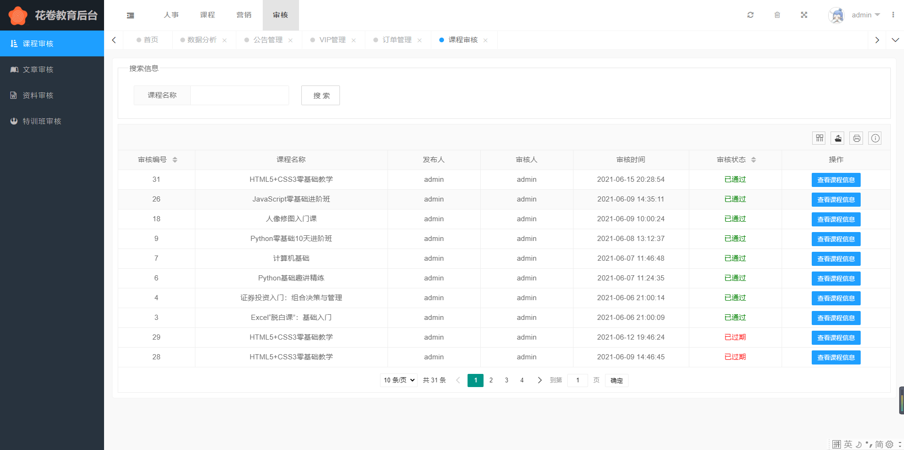

# Steamed Bread Roll Education

#### 前言

花卷教育 | 随时随地 · 一站学习

项目致力于提供一个一站式学习平台，采用现阶段流行技术实现。

#### 项目体验

后台管理系统`breadroll-admin`地址：http://admin.qiudb.top

```java
用户名: admin  密码: 123456
```

用户教育系统`breadroll-education`地址：http://edu.qiudb.top

```java
用户名: 1325554003@qq.com	密码: M123456
```


#### 项目介绍

`Bread Roll Education` 是一套在线教育平台，包括用户在线学习系统及后台管理系统。

用户学习平台共分为九大模块，包括**课程预告、在线课程观看、学习资料下载、学习文章预览、线下班报名、用户消息通知、个人信息管理、VIP详情介绍、客服和签到系统**等模块；

后台管理系统共分为七大模块，包括**人事管理、课程管理、学习资料管理、锦囊管理、营销管理、订单管理、系统审核**等模块；

项目共分为两个系统

后台管理系统采用 Springboot + thymeleaf +layui 编写


用户平台采用 Springboot + Vue + ElementUI 编写；


项目数据库设计


#### 项目技术

后端技术

| 技术           | 说明                | 官网                                           |
| -------------- | ------------------- | ---------------------------------------------- |
| SpringBoot     | 容器+MVC框架        | https://spring.io/projects/spring-boot         |
| SpringSecurity | 认证和授权框架      | https://spring.io/projects/spring-security     |
| MyBatis        | ORM框架             | http://www.mybatis.org/mybatis-3/zh/index.html |
| PageHelper     | MyBatis物理分页插件 | http://git.oschina.net/free/Mybatis_PageHelper |
| MySQL          | 数据库              | https://www.mysql.com/                         |
| Redis          | 分布式缓存          | https://redis.io/                              |
| Swagger-UI     | 文档生成工具        | https://github.com/swagger-api/swagger-ui      |
| Druid          | 数据库连接池        | https://github.com/alibaba/druid               |
| sa-token       | 认证和授权框架      | http://sa-token.dev33.cn/                      |

前端技术

| 技术                | 说明               | 官网                                                  |
| ------------------- | ------------------ | ----------------------------------------------------- |
| Vue                 | 前端框架           | https://vuejs.org/                                    |
| Vue-router          | 路由框架           | https://router.vuejs.org/                             |
| Vuex                | 全局状态管理框架   | https://vuex.vuejs.org/                               |
| Element             | 前端UI框架         | [https://element.eleme.io](https://element.eleme.io/) |
| Axios               | 前端HTTP框架       | https://github.com/axios/axios                        |
| vue-clipboard2      | 将内容复制到剪贴板 | https://github.com/Inndy/vue-clipboard2               |
| vuex-persistedstate | vuex持久化         | https://www.npmjs.com/package/vuex-persistedstate     |
| nprogress           | 进度条控件         | https://github.com/rstacruz/nprogress                 |


#### 开发环境

| 工具  | 版本号 | 下载                                                         |
| ----- | ------ | ------------------------------------------------------------ |
| JDK   | 1.8    | https://www.oracle.com/technetwork/java/javase/downloads/jdk8-downloads-2133151.html |
| Mysql | 5.7    | https://www.mysql.com/                                       |
| Redis | 5.0.10 | https://redis.io/download                                    |


#### 项目部署

将项目通过maven打成jar包，服务器运行jar包即可

需开放的端口号：

```
9000	# 管理系统端口号
8000	# 用户系统端口号
3306	# mysql 主机端口
6379	# redis 数据库
994		# 网易163邮箱 服务端口
```


#### 支付宝沙箱支付

支付帐号：[ilikkj2173@sandbox.com](mailto:ilikkj2173@sandbox.com)

登录密码：111111

支付密码：111111


#### 项目演示

##### 免责声明

本项目为学校的课程实训，只为了应对学校的课程项目而编写

系统中一些设计，来源于[万门大学](https://www.wanmen.org/)和[KuangStudy](https://www.kuangstudy.com/)

为了系统更真实美观，项目内的课程内容、课程封面、特训班封面等信息来源于[万门大学](https://www.wanmen.org/)

系统内的支付系统为支付宝沙箱虚拟支付，不作商业用途


##### 项目预览

用户教育系统 - 首页


用户教育系统 - 登录页


用户教育系统 - 登录成功


用户教育系统 - 课程预告


用户教育系统 - 下载学习资料


用户教育系统 - VIP介绍


用户教育系统 - 学习锦囊


用户教育系统 - 预览文章


用户教育系统 - 课程介绍


用户教育系统 - 观看课程


用户教育系统 - 特训班（线下班）


用户教育系统 - 特训班报名


用户教育系统 - 账户中心


用户教育系统 - 个人信息


用户教育系统 - 我的课程


用户教育系统 - 最近学习


用户教育系统 - 系统消息


用户教育系统 - 个人消息


用户教育系统 - 我的订单


用户教育系统 - 我的花卷币


用户教育系统 - 我的特训班


后台管理系统 - 首页


后台管理系统 - 人事管理

共包括部门管理、角色管理、员工管理、用户管理、讲师管理五部分

后台管理模块太多，不方便挨个截图，直接访问http://admin.qiudb.top，用户名：admin，密码123456


后台管理系统 - 课程管理

课程管理包括课程预告、课程类别、课程管理、课程目录、特训班管理五部分


后台管理系统 - 资料管理


后台管理系统 - 文章管理


后台管理系统 - 营销模块

营销模块包括数据分析、公告管理、VIP管理、轮播图管理、订单管理五部分


后台管理系统 - 审核模块

审核模块包括课程审核、文章审核、资料审核、特训班审核




